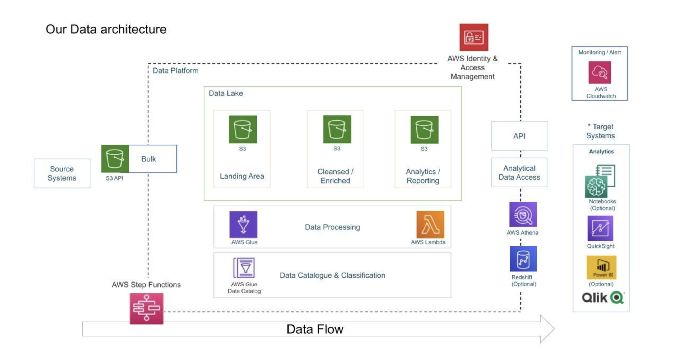

<!-- # youtube-data-engineering-aws
End-to-end AWS data engineering pipeline for YouTube trending analytics -->

# YouTube Data Engineering Pipeline on AWS

## 1. Project Overview

1. This project implements an end-to-end, serverless data engineering pipeline on AWS using the YouTube Trending dataset from Kaggle.
2. The goal is to ingest raw data, transform it into an analytics-optimized format, and enable SQL-based analysis using AWS services.
3. The pipeline uses Amazon S3 as a data lake, AWS Lambda for ETL, AWS Glue for metadata management, and Amazon Athena for querying.
4. The solution is designed to be scalable, cost-efficient, and fully serverless.

---

## 2. Problem Statement

1. Raw YouTube trending data is available in CSV and JSON formats and is not directly optimized for analytics.
2. Multi-line and nested JSON formats cause issues with direct querying using AWS Glue and Athena.
3. Large CSV and JSON files are inefficient and expensive to query directly.
4. This project solves these problems by converting raw data into partitioned Parquet format and enabling fast, cost-efficient SQL analytics.

---

## 3. High-Level Architecture

1. Kaggle Dataset
2. Amazon S3 (Raw Data Bucket)
3. AWS Lambda (ETL: Clean and Convert to Parquet)
4. Amazon S3 (Cleansed Data Bucket)
5. AWS Glue Data Catalog and Crawler
6. Amazon Athena (SQL Analytics)

---

## 4. Architecture Diagram

The following diagram represents the overall system design:

---

## 5. Tech Stack

1. Amazon S3 for data lake storage
2. AWS Lambda for serverless ETL processing
3. AWS Glue for metadata catalog and crawlers
4. Amazon Athena for SQL-based analytics
5. AWS IAM for security and access control
6. Amazon CloudWatch for logging and monitoring
7. Python (pandas, awswrangler, pyarrow) for data processing
8. SQL for analytics queries

---

## 6. Data Flow

1. Download the YouTube Trending dataset from Kaggle.
2. Upload raw CSV and JSON files to Amazon S3 using AWS CLI with region-based partitioning.
3. Attempt to crawl raw data using AWS Glue and identify JSON format limitations.
4. Build an AWS Lambda ETL function to clean, normalize, and convert data into Parquet format.
5. Store processed data in a separate cleansed S3 bucket.
6. Run an AWS Glue Crawler to create tables in the Glue Data Catalog.
7. Query the cleaned data using Amazon Athena for analytics.

---

## 7. Repository Structure

1. `lambda/`
   Contains the AWS Lambda ETL Python code used to transform raw data into Parquet.

2. `athena/`
   Contains SQL queries used for analytics in Amazon Athena.

3. `docs/`
   Contains detailed documentation such as architecture design and AWS setup steps.

4. `scripts/`
   Contains helper scripts such as AWS CLI scripts to upload data to S3.

5. `screenshots/`
   Contains screenshots of S3 buckets, Glue tables, and Athena query results as proof of execution.

6. `README.md`
   Contains the main project overview and documentation.

---

## 8. How to Run This Project

1. Create an AWS account and configure IAM users and roles.
2. Create an S3 bucket for raw data and upload the Kaggle dataset using AWS CLI.
3. Create an S3 bucket for cleansed data.
4. Deploy the AWS Lambda function with required dependencies (pandas, awswrangler, pyarrow).
5. Run the Lambda function to transform raw data into Parquet.
6. Create a Glue database and run a Glue Crawler on the cleansed S3 bucket.
7. Open Amazon Athena and run SQL queries on the generated tables.

---

## 9. Example Analytics Use Cases

1. Count total videos by region.
2. Find top trending videos by view count.
3. Analyze most liked videos.
4. Compare average views across regions.
5. Identify top channels by total views.
6. Perform engagement analysis using likes-to-views ratio.

---

## 10. Screenshots

1. S3 Raw Bucket Structure
2. S3 Cleansed Bucket with Parquet Files
3. AWS Glue Tables in Data Catalog
4. Amazon Athena Query Results

(See the `screenshots/` folder for full images.)

---

## 11. Security and Best Practices

1. The AWS root account is not used for daily development.
2. IAM roles and policies are used for all service access.
3. No AWS credentials or secrets are stored in this repository.
4. Data files are not committed to GitHub.
5. Access follows the principle of least privilege.

---

## 12. Scalability and Performance

1. The pipeline is fully serverless and scales automatically with data size.
2. Parquet format reduces storage size and improves query performance.
3. Partitioned data layout reduces Amazon Athena scan costs.
4. New data can be added and reprocessed using the same pipeline.

---

## 13. Future Improvements

1. Add orchestration using AWS Step Functions or Amazon EventBridge.
2. Automate data ingestion using scheduled jobs or APIs.
3. Add data quality checks and validation in the ETL pipeline.
4. Build dashboards using Amazon QuickSight or other BI tools.
5. Implement incremental processing instead of full reprocessing.

---

## 14. What I Learned

1. How to design a serverless data lake architecture on AWS.
2. How to build ETL pipelines using AWS Lambda and Python.
3. How to use AWS Glue for metadata management and schema discovery.
4. How to query large datasets efficiently using Amazon Athena.
5. How to optimize analytics workloads using Parquet and partitioning.
6. How to structure and document a real-world data engineering project.

---

## 15. Conclusion

1. This project demonstrates a complete, real-world data engineering workflow on AWS.
2. It covers ingestion, transformation, storage, cataloging, and analytics.
3. The solution is scalable, cost-efficient, and suitable for production-style analytics workloads.
4. This repository serves as a practical example of modern cloud-based data engineering.

---
