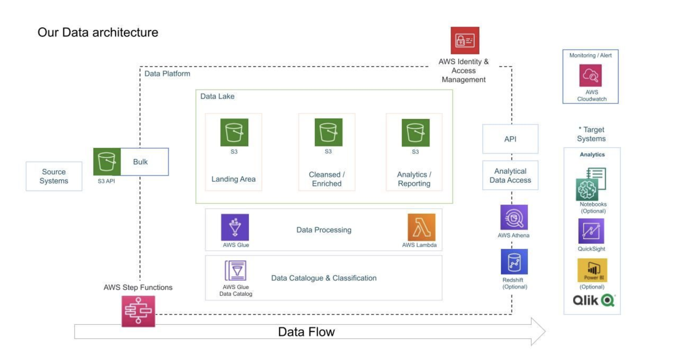

Architecture – YouTube Data Engineering Pipeline (AWS)

1. Overview

This project implements an end-to-end serverless data engineering pipeline on AWS to process YouTube trending video data. The system ingests raw JSON/CSV data into Amazon S3, transforms it into optimized columnar Parquet format using AWS Lambda, catalogs the processed data using AWS Glue, and enables SQL-based analytics using Amazon Athena. The architecture is designed to be scalable, cost-efficient, and fully serverless.

2. High-Level Architecture

Data Flow:

Kaggle Dataset
      |
      v
Amazon S3 (Raw Data Bucket)
      |
      v
AWS Lambda (ETL: JSON → Parquet)
      |
      v
Amazon S3 (Processed Data Bucket)
      |
      v
AWS Glue Data Catalog + Crawler
      |
      v
Amazon Athena (SQL Analytics)
      |
      v
(Optional) Dashboard / BI Tool

3. Components and Their Roles
3.1 Amazon S3

Used as the data lake storage layer.

Two logical layers:

Raw bucket: Stores original YouTube JSON/CSV files partitioned by region.

Processed bucket: Stores cleaned data in Parquet format for efficient querying.

Partitioning by region improves query performance and reduces Athena scan cost.

3.2 AWS Lambda (ETL Layer)

Serverless ETL component written in Python.

Responsibilities:

Read raw JSON files from S3.

Normalize and flatten nested JSON using pandas.

Convert data to Parquet using awswrangler.

Write processed data back to S3.

Chosen for:

No server management

Automatic scaling

Cost efficiency for event-based workloads

3.3 AWS Glue Data Catalog

Stores metadata (schema, partitions, table definitions) of processed data.

Glue Crawler automatically discovers schema from Parquet files in S3.

Makes the dataset queryable by Athena using SQL.

3.4 Amazon Athena

Serverless SQL query engine used to analyze the processed YouTube data.

Queries run directly on S3 data using the Glue Data Catalog.

Used for:

Exploratory data analysis

Aggregations by region, category, views, likes, etc.

3.5 IAM (Security)

IAM roles are used to:

Allow Lambda to read/write S3 and update Glue Catalog.

Allow Glue to access S3 buckets.

Enforce least-privilege access instead of using root credentials.

4. Design Decisions

Parquet Format: Chosen for columnar storage, better compression, and faster Athena queries.

Serverless Architecture: Using Lambda, Glue, and Athena avoids server management and scales automatically.

Partitioned Data Layout: Data is partitioned by region to reduce query scan size and cost.

Glue Crawler: Automates schema discovery instead of manual table creation.

5. Scalability and Reliability

The pipeline is fully serverless and scales automatically with data size.

New data can be added to the raw S3 bucket and reprocessed using the same Lambda function.

Glue Crawlers can be scheduled to keep the catalog updated.

Athena can handle large-scale analytical queries without infrastructure provisioning.

6. Future Improvements

Add orchestration using AWS Step Functions or EventBridge.

Automate ingestion using scheduled jobs or API pulls.

Add data quality checks and validation.

Build dashboards using Amazon QuickSight or other BI tools.

Add incremental processing instead of full reprocessing.

7. Architecture Diagram

